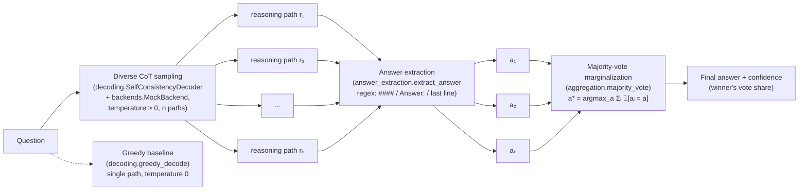

# self-consistency

A runnable Python implementation of **"Self-Consistency Improves Chain of Thought Reasoning in Language Models"** (Wang et al., ICLR 2023, [arXiv:2203.11171](https://arxiv.org/abs/2203.11171)).

Instead of trusting a single greedy chain-of-thought, self-consistency samples *many diverse reasoning paths* and takes a **majority vote** over their final answers — marginalizing out the reasoning to pick the answer most paths agree on. This repo implements the full decoding loop, runs **entirely offline** via a seeded mock LLM, and includes an optional OpenAI-compatible backend for real models.

## Setup

Requires Python 3.9+.

```bash
git clone https://github.com/sulaimanvesal/self-consistency.git
cd self-consistency
pip install -r requirements.txt   # pytest only; openai is optional
```

## Usage

### Offline demo (no API key, no network)

```bash
python -m self_consistency demo
# or
python demo/demo_offline.py
```

Samples 7 diverse reasoning paths per question, prints each path, the extracted
answers, the vote counts, the winner, and its confidence.

### Evaluate: greedy CoT vs. self-consistency

```bash
python -m self_consistency evaluate
```

Runs all 12 built-in arithmetic problems with both the single-path greedy
baseline and self-consistency, printing a per-question table and accuracies.

### Library

```python
from self_consistency import MockBackend, SelfConsistencyDecoder, SAMPLE_PROBLEMS, greedy_decode

backend = MockBackend(seed=0, problems=SAMPLE_PROBLEMS)
decoder = SelfConsistencyDecoder(backend, n_samples=11, temperature=0.7)

result = decoder.decode("Janet has 3 apples. She buys 4 more, then gives 2 away. How many does she have now?")
print(result.final_answer, result.confidence, result.vote_counts)

baseline = greedy_decode("...", backend)   # single path, temperature 0
```

### Real models (optional)

```python
from self_consistency import OpenAICompatBackend, SelfConsistencyDecoder

backend = OpenAICompatBackend(model="gpt-4o-mini")  # needs OPENAI_API_KEY; works with any OpenAI-compatible endpoint via base_url=
decoder = SelfConsistencyDecoder(backend, n_samples=10)
print(decoder.decode("...").final_answer)
```

The `openai` package is only imported lazily inside `OpenAICompatBackend` — the
offline path never touches it.

## Architecture



## Paper → Code mapping

| Paper concept | Code |
|---|---|
| Diverse reasoning-path sampling (temperature sampling, *m* paths) | `backends.MockBackend.generate(prompt, temperature>0)` — seeded template variants of correct arithmetic + a minority of plausible-wrong paths; `OpenAICompatBackend` for real models |
| Reasoning paths *r₁ … rₘ* | `decoding.DecodingResult.paths` |
| Final-answer extraction from each path | `answer_extraction.extract_answer` (`####` / `Answer:` / last-line-number cascade, configurable via `make_extractor`) |
| Answer marginalization: *a\* = argmaxₐ Σᵢ 𝟙[aᵢ = a]* | `aggregation.majority_vote` (+ `normalize_answer` so "42", "42.0", "1,000" count as one vote); deterministic first-seen tie-breaking |
| Greedy CoT baseline (single path, T=0) | `decoding.greedy_decode` |
| Accuracy gains of voting over greedy | `decoding.evaluate` + `python -m self_consistency evaluate` |
| Sample benchmark set | `datasets.SAMPLE_PROBLEMS` — 12 handwritten GSM8K-style problems with gold answers and step annotations (no downloads) |

## Results (built-in sample set, seeded mock)

Typical run of `python -m self_consistency evaluate` (n=11, seed=0):

```
greedy CoT accuracy:        66.7%
self-consistency accuracy:  100.0%
```

Voting over diverse paths fixes the questions where the single greedy path
slips — the paper's headline effect, reproduced on the toy set.

## Tests

```bash
python -m pytest -q
```

Covers majority vote + deterministic tie-breaking, answer normalization,
extraction edge cases, `MockBackend` determinism (same seed → same paths),
decoder end-to-end (final answer equals the majority), and `evaluate()`.

## License

MIT — see [LICENSE](LICENSE).
